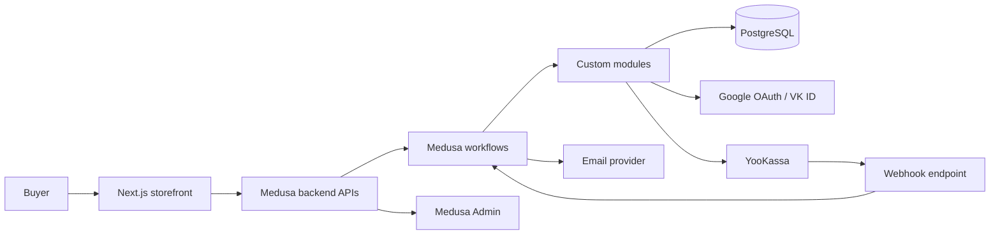
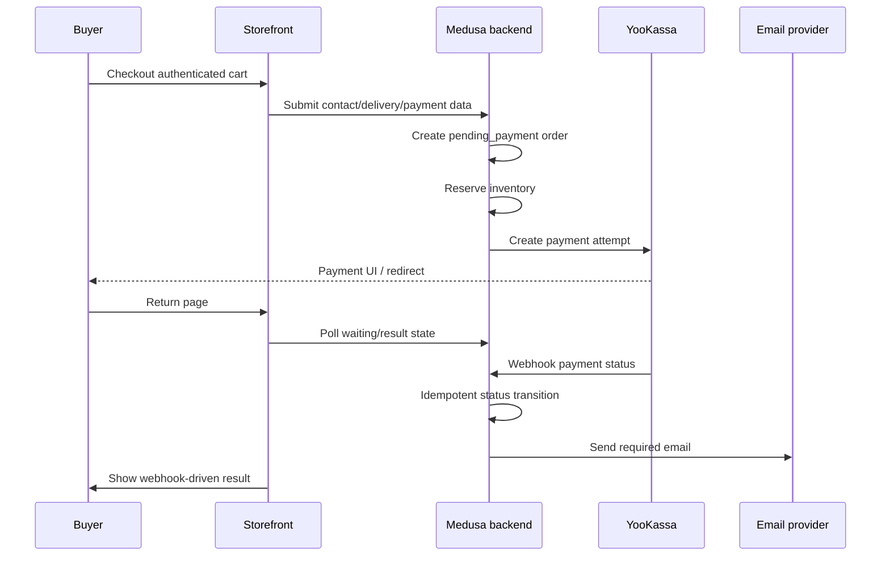

# System Architecture

## System Goal

Build a KISS MVP internet shop for home goods with a Next.js storefront, Medusa v2 backend, PostgreSQL storage, Medusa Admin operations, YooKassa payments, OAuth login, email notifications, and reproducible local development on Windows 10 without Docker containers.

The architecture constrains implementation work so agents preserve purchase-flow correctness, avoid Medusa Core changes, and keep payment, order, inventory, auth, and customer data safe.

## Main Constraints

- Keep the product as a medium-complexity MVP.
- Do not modify Medusa Core.
- Backend extensions use API -> Workflows -> Modules.
- External integrations are isolated as modules.
- YooKassa webhook is the authoritative payment status source.
- Return pages are never authoritative payment confirmation.
- Auth, payments, order lifecycle, stock reservation, production/deploy, destructive data, and compliance-sensitive work route through high-tier task policy.

## Non-goals

- Microservices, enterprise abstractions, custom admin replacement, 1C, CDEK/Boxberry, marketplace, B2B, mobile app, SMS confirmation, bonuses/loyalty, external delivery-provider calculation/tracking, and fiscalization/receipts inside MVP.

## Architecture Style

Use a modular monolith split by product boundary, not by deployable microservice:

- Storefront: Next.js/TypeScript buyer UI.
- Backend: Medusa v2/TypeScript with custom APIs, workflows, modules, subscribers, and payment/auth/notification integrations.
- Storage: PostgreSQL as the durable data store for Medusa and custom backend data.
- Admin: Medusa Admin as the MVP operator surface.
- Local runtime: Windows-native npm processes start storefront/backend, and PostgreSQL runs locally on Windows 10 for development and verification.

No separate search service, event bus, cache service, custom admin application, or delivery-provider service is part of the MVP unless a later explicit spec changes scope.

## Source Of Truth

Decision precedence:

1. Constitution and explicit user decisions.
2. Existing production code, once created.
3. ADRs.
4. Authoritative contracts and specs.
5. PRD, requirements, epics, and features.
6. User scenarios.
7. Task records.
8. Agent assumptions.

Runtime source-of-truth rules:

- Product, category, variant/SKU, cart, customer, checkout, order, inventory, and payment records are backend/PostgreSQL concerns exposed through Medusa or custom backend APIs.
- The storefront may store only non-authoritative client state such as a guest cart reference, UI state, or return-page polling state.
- OAuth providers are external identity proof sources; local customer/session ownership is still backend-owned.
- YooKassa webhook owns payment status confirmation. The return page may display waiting/result state but cannot mark payment successful.
- Email delivery state is an integration side effect; order/payment state remains backend-owned.

## Main Modules / Bounded Contexts

| Context | Owner | Responsibility | Constraints |
|---|---|---|---|
| Storefront | Next.js app | Catalog, product detail, cart UI, login gate, checkout UI, return/waiting page. | No direct DB access; no authoritative payment success writes. |
| Catalog | Medusa backend | Products, categories, variants/SKU, catalog filters/search source. | Keep search/filter MVP moderate; no external search engine by default. |
| Cart and customer identity | Medusa backend plus auth integration | Guest cart, customer cart, cart merge, wishlist ownership, OAuth callback handling. | Auth/privacy tasks likely T3. |
| Checkout and order workflow | Medusa workflows/modules | Contact/delivery/payment selection, pending order creation, order lifecycle. | Must reserve inventory before payment and preserve data. |
| Inventory reservation | Backend workflow/module | Reserve, release, and finalize stock around pending-payment orders. | State changes require integration evidence. |
| Payment integration | Isolated backend module | YooKassa payment creation, webhook verification, retry, status mapping, idempotency. | Webhook is source of truth; duplicate events have no duplicate side effects. |
| Notification integration | Isolated backend module | Email triggers for pending order, payment success/error, and order status change. | Sends follow committed state; duplicate suppression is required where webhook repeats can trigger email. |
| Admin operations | Medusa Admin | Operator visibility for contacts, products, delivery, payment/order status, total, and payment method. | No custom admin replacement in MVP. |
| Local development | Windows-native npm scripts and local PostgreSQL | Local storefront/backend/database path and smoke gates. | No Docker containers for local development; no production secrets in repo. |

## Data Flow

1. Catalog browse: storefront reads products/categories/variants from backend APIs and renders filters/search results.
2. Cart flow: guest cart is created and updated through backend APIs; browser stores only the cart reference/session data needed to resume.
3. Login flow: OAuth callback establishes customer identity; if a guest cart exists, backend merge logic sums identical variants/SKU and revalidates stock constraints.
4. Checkout flow: authenticated customer submits contact, delivery, and payment method data; backend creates a `pending_payment` order and reserves inventory.
5. Payment flow: backend creates a YooKassa payment attempt; buyer returns to storefront waiting/result page; YooKassa webhook authoritatively updates payment/order status.
6. Operations and notifications: backend state updates trigger email notifications and make required fields visible in Medusa Admin.

## External Integrations

- Google OAuth and VK ID are auth integrations isolated behind backend auth/customer identity boundaries.
- YooKassa payment creation, return URL handling, and webhook processing live in an isolated payment module/integration.
- Email provider/SMTP is selected during feature design and must stay isolated behind a notification module.
- Delivery providers are out of scope; delivery methods use fixed tariffs in backend logic.
- Local/staging credentials, webhook tunneling, and email provider configuration are feature/design inputs, not hardcoded architecture assumptions.

## Storage Decisions

- PostgreSQL is the only durable data store in the MVP.
- Browser storage can only hold non-authoritative references or UI state.
- Custom persistent data should extend Medusa through supported extension mechanisms and migrations, not through Medusa Core edits.
- Payment webhook idempotency needs durable replay/processed-event state keyed by provider/payment identifiers before webhook tasks can be closed.
- Inventory reservation state must be durable enough to release/finalize correctly after payment, cancellation, timeout, or retry.
- Production migrations or destructive data operations are T3 and require explicit rollback/recovery evidence.

## API / Contract Boundaries

- The storefront communicates with backend HTTP APIs; it does not call PostgreSQL or provider APIs directly.
- Custom backend APIs must follow [.memory-bank/contracts/api-guidelines.md](../contracts/api-guidelines.md).
- Generated OpenAPI may be used after backend schemas exist; a handwritten OpenAPI file is not the global source of truth at this phase.
- Detailed feature endpoint schemas belong to feature-local design specs from `/prd-to-tasks`, standalone `/spec-improve` repair outputs, or concrete contract files, not this architecture overview.

## Event / Message Model

- No custom event bus, distributed queue, or message broker is part of the MVP backbone.
- External incoming events are HTTP webhooks, primarily YooKassa.
- Internal side effects may use Medusa workflows/subscribers where appropriate, but business correctness stays in backend workflow/module code with durable state.
- Email triggers must follow committed order/payment state and must tolerate repeated webhook processing without duplicate customer-visible effects.

## Agent I/O Boundary

There is no runtime agent, chat, or AI I/O boundary in the product. Agent-only execution artifacts remain in `.tasks/`, `.protocols/`, `.memory-bank/packets/`, and task records.

## Security / Safety Constraints

- Never commit provider secrets, OAuth client secrets, payment credentials, or production data.
- Validate authenticated ownership for cart, wishlist, checkout, order, and payment-start actions.
- Validate YooKassa webhook authenticity and idempotency before changing payment/order state.
- Avoid logging sensitive customer contact data, OAuth tokens, payment credentials, or webhook secrets.
- Treat auth, payment, webhook, order lifecycle, inventory reservation, deploy/runtime, destructive data, and compliance-sensitive implementation as T3 unless a later task record justifies a lower tier.

## Testing Strategy

Use [.memory-bank/testing/index.md](../testing/index.md) and [.memory-bank/workflows/tier-policy.md](../workflows/tier-policy.md).

- Unit tests: pure cart merge, tariff calculation, variant validation, timeout calculation, and transition guards.
- Integration tests: cart persistence/merge, OAuth callback mocks, pending order creation, reservation/release, webhook idempotency, and email trigger boundaries.
- E2E tests: browse/filter -> variant -> cart -> login -> checkout -> pending order -> simulated webhook -> visible order/payment result.
- High-tier tasks require `/verify`; T2/T3 require `/red-verify`; T3 requires human checkpoint and rollback/recovery markers before closure.

## Deployment Assumptions

- The only designed local runtime path in this backbone is Windows 10 native development with local Node.js/npm processes and local PostgreSQL.
- Docker remains excluded from local development.
- Remote server deployment runbook lives in [DEPLOYMENT.md](../../DEPLOYMENT.md): AlmaLinux VPS, Docker Compose application containers, PostgreSQL container, and host-level Caddy reverse proxy with automatic HTTPS.
- Any remote deploy, Docker server deployment, live payment mutation, production migration, or production secret handling must be scoped as T3 with explicit operator approval and rollback/recovery notes.

## Risks

- YooKassa local/staging credentials and webhook tunneling are unresolved and must be handled in payment/local-dev feature design.
- Fiscalization/receipt duties are out of MVP implementation scope but can block production launch if legal/payment review says they are required.
- Exact Medusa v2 extension points for order status, inventory reservation, and admin visibility must be confirmed in feature-local design before implementation tasks.
- Email provider/configuration remains unselected and must be decided before notification implementation.

## Open Questions

- Which email provider or SMTP configuration will be used for MVP local/staging?
- Which YooKassa local/staging account, webhook URL, and tunneling approach will be available?
- Which exact Medusa extension points will own reservation release/finalization and status/admin field mapping?
- Which external PostgreSQL backup target and production registry/tag policy will be used for the VPS deployment?

These questions do not block the global backbone. They block only the feature-local specs or implementation tasks that require those details.

## Handoff

- Run `/prd-to-tasks FT-<NNN>` for each selected feature; it completes feature-level SDD design before task slicing.
- Use standalone `/spec-improve FT-<NNN>` only when feature design needs repair/refresh without creating or updating task records.
- Do not implement business features until the foundation executable baseline exists or a later explicit decision narrows scope.
